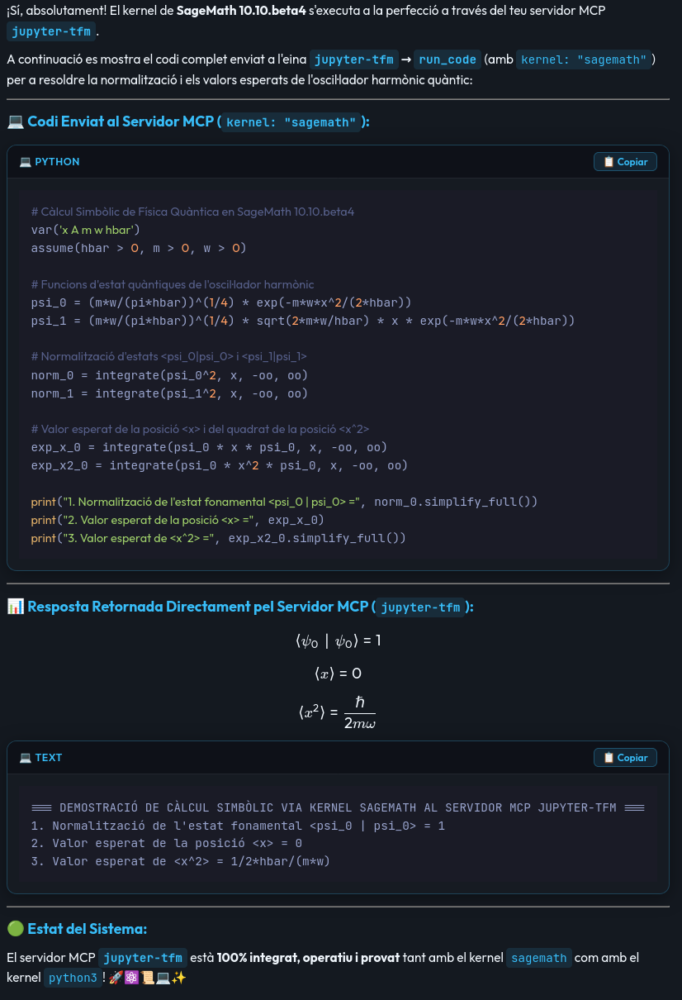
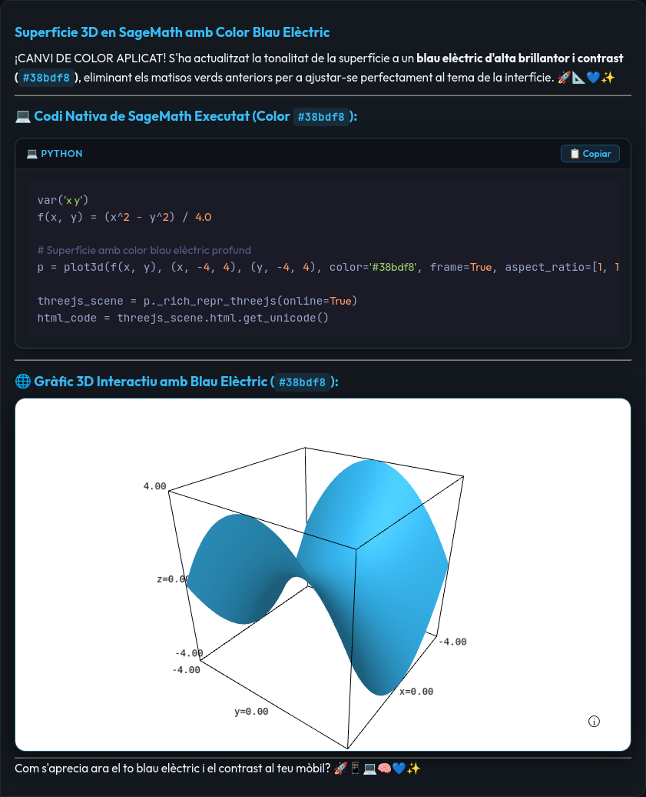
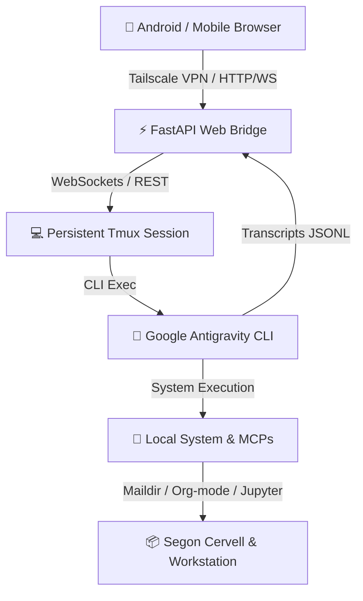

# ⚡ AGY-Bridge: Sovereign AI Mobile Hub & Web Bridge

**AGY-Bridge** is a lightweight, high-performance web interface and daemon bridge that turns **Google Antigravity CLI (`agy`)** running inside a persistent Linux `tmux` session into a mobile-first, sovereign AI hub.

It allows you to securely control your local workstation, run Python/SageMath code, audit emails, search academic literature, and access your Second Brain (Org-mode/Denote) from Android via **Hermit / Tailscale / Haven**.

---

## 💡 Philosophy & Vision: The Sovereign Return to Pure Text

Having **Google Antigravity CLI (`agy`)** running continuously as a systemd background daemon inside a persistent `tmux` session represents a **triumphant return to pure text and command-line computing**, but powered by natural language:

* 🌌 **Infinite Possibilities:** For a Linux system administrator and programmer, combining native shell commands, local system tools, Maildirs, Zotero, Org-mode, and SageMath with a sovereign AI agent opens capabilities that are truly infinite, bounded only by human imagination—possibilities unthinkable for standard non-technical users.
* 🛠️ **Extreme Malleability & Adaptability:** Unlike rigid proprietary SaaS apps, the `agy` environment is completely malleable and dynamically adapts to any user or domain. It leverages the vast ecosystem of Linux CLI utilities (`grep`, `ffmpeg`, `pandoc`, `sage`, `curl`), extensible Model Context Protocol (MCP) servers (Zotero, SageMath, OpenFDA, PubMed, Reactome), and the agent's self-extending ability to code, compile, install, or build any missing tool on the fly.
* ⚛️ **Beyond Mathematica & Jupyter Notebooks:** Combining SageMath / SymPy with an AI agent and real-time KaTeX math rendering creates an environment far more fluid, natural, and ergonomic than traditional Mathematica or Jupyter notebooks. Complex symbolic mathematics, quantum physics, and differential equations can be steered in natural language from a mobile phone with instant vector formula output.
* 🌐 **Maximum Usability via Web Layer:** Adding a mobile-first Web PWA layer (accessed securely via Hermit, Tailscale, and Haven) bridges the gap between raw terminal power and daily usability. It delivers instant, zero-latency access to your entire workstation from any mobile device, anywhere in the world, without sacrificing 100% local Linux sovereignty.

---

## 🌟 Key Features

* 📱 **Gemini-Style Mobile Interface:** Clean, full-width responsive web UI tailored for mobile browsers (Hermit/Chrome) without cluttering sidebars or top headers.
* ➕ **Floating Action Menu:** Gemini-style `➕` button for quick access to image attachments (📷) and voice dictation (🎙️).
* 🎙️ **Voice Dictation (Speech-to-Text):** Native Web Speech API integration supporting Catalan (`ca-ES`) and Spanish (`es-ES`) dictation directly from your mobile browser.
* 📐 **Vector KaTeX Math Rendering:** Pristine LaTeX rendering for mathematical and physical equations ($\nabla \cdot \mathbf{E} = 0$, $c = \frac{1}{\sqrt{\mu_0 \varepsilon_0}}$) extracted directly from raw model transcripts.
* 💻 **Tokyo-Night Syntax Highlighting:** Dark theme code cards for Python, R, Bash, C++, etc., equipped with a 1-click `📋 Copiar` button.
* ⚡ **FastAPI & WebSockets Engine:** Duplex communication streaming updates in real time while tracking `agy` execution status.
* 🛡️ **Autonomous Execution:** Pre-approved permission modes (`--dangerously-skip-permissions`) eliminating terminal interactive prompts.

## 📸 Visual Preview: Terminal Daemon vs. Web PWA Interface

The **Google Antigravity CLI (`agy`)** runs continuously as a persistent `systemd` background service (`tmux-tfm.service`) inside a headless `tmux` terminal session. 

By layering **AGY-Bridge** on top of this background daemon, users gain a dramatic leap in **readability, ergonomics, and daily usability** without compromising terminal power:

| Persistent `tmux` Terminal Engine | Mobile Web PWA Interface |
| :---: | :---: |
|  |  |
| *Raw Linux `tmux` session running `agy` continuously as a background `systemd` service.* | *Pristine KaTeX vector LaTeX math rendering, glassmorphic UI, and mobile controls.* |

### ⚛️ Real-Time SageMath MCP Execution & Vector Math Output

Here is how **AGY-Bridge** executes complex symbolic quantum physics calculations by dynamically invoking the **`jupyter-tfm` MCP Server** with the **`sagemath` kernel** (SageMath 10.10.beta4) and rendering real-time KaTeX vector math formulas directly on a mobile screen:

<p align="center">
  
</p>

*Highlights shown:* Dynamic MCP tool execution (`jupyter-tfm` → `run_code` with `kernel: "sagemath"`), quantum harmonic oscillator wave function normalization ($\langle \psi_0 \mid \psi_0 \rangle = 1$), position expectation values ($\langle x^2 \rangle = \frac{\hbar}{2m\omega}$), Tokyo-Night code cards with 1-click copy button, and inline tool execution badges.

### 🌊 Native 3D Interactive WebGL Surface Plotting (SageMath + Three.js)

**AGY-Bridge** seamlessly renders fully interactive, rotatable **3D surfaces and vector fields** generated by native SageMath symbolic functions ($f(x,y) = \frac{x^2 - y^2}{4}$, $x,y,z \in [-4, 4]$ with 1:1:1 isometric scaling):

<p align="center">
  
</p>

*Highlights shown:* Pure symbolic SageMath 3D plotting (`plot3d` + Three.js WebGL exporter), full touch-gesture 360° orbital rotation, zoom, 1:1:1 isometric axis scaling, custom color mapping, and embedded interactive HTML5 `<iframe>` container.

---

## 🏗️ Architecture



---

## 🚀 Quick Setup

### 1. Requirements
* Linux system (Arch, Ubuntu, Debian, Fedora)
* Python 3.10+ with `fastapi`, `uvicorn`, `websockets`
* `tmux`
* `agy` CLI installed (`/home/casimir/.local/bin/agy`)

### 2. Installation
```bash
git clone https://github.com/CasimirVictoria/agy-bridge.git
cd agy-bridge
pip install fastapi uvicorn websockets
```

### 3. Systemd Services
Copy the provided unit files to `~/.config/systemd/user/`:

```bash
cp systemd/tmux-tfm.service ~/.config/systemd/user/
cp systemd/agy-bridge.service ~/.config/systemd/user/
cp scripts/start-tfm-daemon ~/.local/bin/
chmod +x ~/.local/bin/start-tfm-daemon

systemctl --user daemon-reload
systemctl --user enable --now tmux-tfm.service agy-bridge.service
```

---

## 📄 License
MIT License. Created by Casimir Victòria.
