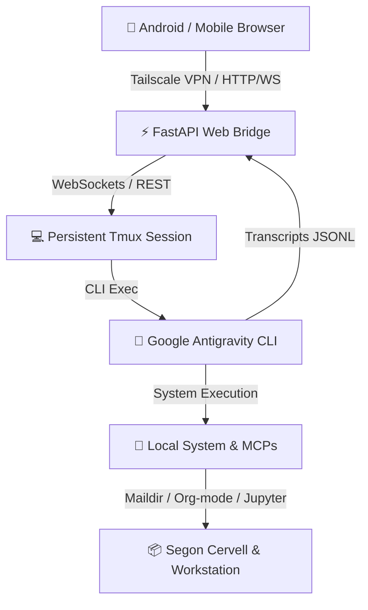

# ⚡ AGY-Bridge: Sovereign AI Mobile Hub & Web Bridge

> [!CAUTION]
> **LEGAL DISCLAIMER & USER LIABILITY NOTICE**
> 
> This repository is published strictly for educational purposes, personal research, and demonstration of a personal workstation architecture. By deploying this software—especially when executing AI agents with unprompted autonomous execution flags (such as `--dangerously-skip-permissions`)—**the user assumes 100% full responsibility for any system damage, data loss, file deletion, security vulnerabilities, or unintended side effects.**
> 
> The author (Casimir Victòria) provides this open-source code "AS IS", without warranty of any kind, express or implied. In no event shall the author be held liable for any claim, damages, or other liability arising from, out of, or in connection with the software or the use of this repository.

**AGY-Bridge** is a lightweight, high-performance web interface and daemon bridge that turns **Google Antigravity CLI (`agy`)** running inside a persistent Linux `tmux` session into a mobile-first, sovereign AI hub.

It allows you to securely control your local workstation, run Python/SageMath code, audit emails, search academic literature, and access your Second Brain (Org-mode/Denote) from Android via **Hermit / Tailscale / Haven**.

> 🌐 **Unlimited Digital Scope:** While the features listed above represent the core baseline implemented in this personal setup, **AGY-Bridge** can control and automate virtually *any* digital domain bounded only by the user's imagination and needs—from querying official government & regulatory databases (OpenFDA, ClinicalTrials), conducting real estate market studies, performing medical & biomedical research (PubMed, Reactome, OpenAlex), comparing supermarket product prices, auditing home solar/battery energy storage (Victron Energy), to executing any custom Linux command-line workflow.

---

## 💡 Philosophy & Vision: The Sovereign Return to Pure Text

Having **Google Antigravity CLI (`agy`)** running continuously as a systemd background daemon inside a persistent `tmux` session represents a **triumphant return to pure text and command-line computing**, but powered by natural language:

* 🧠 **Powered 100% by Google Antigravity & Gemini Engine:** It is fundamental to recognize that **the entire intelligence, reasoning power, and infinite versatility of this system stem directly from Google Antigravity CLI (`agy`) and Google's Gemini models (Gemini 3.6 Flash / Pro)**. `AGY-Bridge` acts merely as a lightweight web interface and daemon bridge; the real magic—autonomous tool execution, writing and compiling Python/SageMath code, searching databases, auditing Maildirs, resolving complex multi-step instructions, and self-extending system capabilities on the fly—is driven entirely by Google's cutting-edge agentic AI engine.
* 🌌 **Infinite Possibilities:** For a Linux system administrator and programmer, combining native shell commands, local system tools, Maildirs, Zotero, Org-mode, and SageMath with a sovereign AI agent opens capabilities that are truly infinite, bounded only by human imagination—possibilities unthinkable for standard non-technical users.
* 🛠️ **Extreme Malleability & Adaptability:** Unlike rigid proprietary SaaS apps, the `agy` environment is completely malleable and dynamically adapts to any user or domain. It leverages the vast ecosystem of Linux CLI utilities (`grep`, `ffmpeg`, `pandoc`, `sage`, `curl`), extensible Model Context Protocol (MCP) servers (Zotero, SageMath, OpenFDA, PubMed, Reactome), and the agent's self-extending ability to code, compile, install, or build any missing tool on the fly.
* ⚛️ **Beyond Mathematica & Jupyter Notebooks:** Combining SageMath / SymPy with an AI agent and real-time KaTeX math rendering creates an environment far more fluid, natural, and ergonomic than traditional Mathematica or Jupyter notebooks. Complex symbolic mathematics, quantum physics, and differential equations can be steered in natural language from a mobile phone with instant vector formula output.
* 🌐 **Maximum Usability via Web Layer:** Adding a mobile-first Web PWA layer (accessed securely via Hermit, Tailscale, and Haven) bridges the gap between raw terminal power and daily usability. It delivers instant, zero-latency access to your entire workstation from any mobile device, anywhere in the world, without sacrificing 100% local Linux sovereignty.

---

## 🌟 Key Features

* 📱 **Gemini-Style Mobile Interface:** Clean, full-width responsive web UI tailored for mobile browsers (Hermit/Chrome) without cluttering sidebars or top headers.
* ➕ **Floating Action Menu:** Gemini-style `➕` button for quick access to image attachments (📷) and voice dictation (🎙️).
* 🎙️ **Voice Dictation (Speech-to-Text):** Native Web Speech API integration supporting Catalan (`ca-ES`) and Spanish (`es-ES`) dictation directly from your mobile browser.
* 💬 **Thematic Independent Chats:** Multi-topic conversation switching (`🌐 General`, `🩺 Health & Supplements`, `🔬 Science & TFM`, `📧 Email & Management`) with automatic backfilling and persistent state.
* 📐 **Vector KaTeX Math Rendering:** Pristine LaTeX rendering for mathematical and physical equations ($\nabla \cdot \mathbf{E} = 0$, $c = \frac{1}{\sqrt{\mu_0 \varepsilon_0}}$) extracted directly from raw model transcripts.
* 🌊 **3D Interactive WebGL Plotting:** Embedded Three.js WebGL containers for native 3D SageMath surfaces ($z = \sin(\sqrt{x^2+y^2})$) with 360° touch rotation, pan, and zoom on mobile.
* 💻 **Tokyo-Night Syntax Highlighting:** Dark theme code cards for Python, R, Bash, C++, etc., equipped with a 1-click `📋 Copiar` button.
* ⚡ **FastAPI & WebSockets Engine:** Duplex communication streaming updates in real time while tracking `agy` execution status.
* 🛡️ **Autonomous Execution:** Pre-approved permission modes (`--dangerously-skip-permissions`) eliminating terminal interactive prompts.

## 📸 Visual Preview: Terminal Daemon vs. Web PWA Interface

The **Google Antigravity CLI (`agy`)** runs continuously as a persistent `systemd` background service (`agy-brain.service`) inside a headless `tmux` terminal session. 

By layering **AGY-Bridge** on top of this background daemon, users gain a dramatic leap in **readability, ergonomics, and daily usability** without compromising terminal power:

| Persistent `tmux` Terminal Engine | Mobile Web PWA Interface |
| :---: | :---: |
|  |  |
| *Raw Linux `tmux` session running `agy` continuously as a background `systemd` service.* | *Pristine KaTeX vector LaTeX math rendering, glassmorphic UI, and mobile controls.* |

### ⚛️ Real-Time SageMath MCP Execution & Vector Math Output

Here is how **AGY-Bridge** executes complex symbolic quantum physics calculations by dynamically invoking the **`jupyter-tfm` MCP Server** with the **`sagemath` kernel** (SageMath 10.10.beta4) and rendering real-time KaTeX vector math formulas directly on a mobile screen:

<p align="center">
  
</p>

*Highlights shown:* Dynamic MCP tool execution (`jupyter-tfm` → `run_code` with `kernel: "sagemath"`), quantum harmonic oscillator wave function normalization ($\langle \psi_0 \mid \psi_0 \rangle = 1$), position expectation values ($\langle x^2 \rangle = \frac{\hbar}{2m\omega}$), Tokyo-Night code cards with 1-click copy button, and inline tool execution badges.

### 🌊 Native 3D Interactive WebGL Surface Plotting (SageMath + Three.js)

**AGY-Bridge** seamlessly renders fully interactive, rotatable **3D surfaces and vector fields** generated by native SageMath symbolic functions ($f(x,y) = \frac{x^2 - y^2}{4}$, $x,y,z \in [-4, 4]$ with 1:1:1 isometric scaling), providing identical rendering parity across Desktop and Mobile browsers:

| 💻 Desktop Web Browser View | 📱 Mobile Android PWA View |
| :---: | :---: |
|  |  |
| *Full desktop web browser rendering with interactive 3D WebGL rotation.* | *Responsive Android mobile PWA view with touch-gesture 360° orbital rotation.* |

*Highlights shown:* Pure symbolic SageMath 3D plotting (`plot3d` + Three.js WebGL exporter), full touch-gesture 360° orbital rotation, zoom, 1:1:1 isometric axis scaling, custom color mapping, and embedded interactive HTML5 `<iframe>` container.

### 🛠️ Self-Modifying & Malleable Ecosystem

**AGY-Bridge** is completely malleable: users can request UI changes, system feature additions, Git commits, privacy refactoring, or new MCP tools in natural language directly from their phone, and the agent modifies its own bridge server, UI, and repository in real time:

<p align="center">
  
</p>

*Highlights shown:* Live self-modification of `server.py` and `README.md`, real-time Git sanitization, automatic tagging (`v2.2-privacy-path-fix`), and background systemd service hot-reloading—all commanded via natural language from an Android phone.

---

## 🏗️ Architecture



### 🏛️ Architectural Rationale: Why `tmux` + `systemd`?

Running **Google Antigravity CLI (`agy`)** inside a persistent `tmux` session controlled by a `systemd` user daemon (rather than a raw headless service) provides five major engineering advantages:

1. 🖥️ **Guaranteed Interactive PTY Environment:** `agy` is an interactive TUI application requiring a pseudo-terminal. `systemd` alone runs headless services without TTYs, which can cause TUI applications to exit. `tmux` creates a persistent PTY in RAM, keeping `agy` fully stable.
2. 🔍 **Live Inspection & Manual Attach:** System administrators can inspect or audit the AI agent in real time from any terminal (`tmux attach -t brain`) and detach (`Ctrl+B, D`) without disrupting background execution.
3. 🌉 **Non-Invasive Web Layer Integration:** `AGY-Bridge` sends inputs via `tmux send-keys` and inspects model status via `tmux capture-pane` without modifying the CLI source code.
4. 🛡️ **Fault Tolerance & Network Decoupling:** Even if SSH connections, WebSockets, or Tailscale VPN tunnels drop, the underlying `agy` execution state remains 100% active in RAM.
5. 🔀 **Multi-Agent Isolation:** Enables running isolated persistent sessions (`brain`, `research`, `math`) for specialized agents in separate workspace directories.

### 🔒 Network Security & Sovereignty: Why Tailscale (WireGuard Mesh)?

Integrating **Tailscale** (a zero-config WireGuard mesh VPN) as the networking foundation provides critical security and privacy advantages:

* 🚫 **Zero Public Internet Exposure (No Router Port Forwarding):** `AGY-Bridge` binds strictly to your private overlay network (`100.x.x.x`). No router ports (e.g. port 8000) are opened to the public internet, completely eliminating automated port scanners, vulnerability probes, and external brute-force attacks.
* 🔐 **End-to-End WireGuard Encryption:** All WebSocket traffic, REST payloads, and media streams transferred between your mobile phone and your Linux workstation are encrypted end-to-end using state-of-the-art WireGuard cryptography across 5G and public Wi-Fi networks.
* 🌍 **Global Anywhere Access Behind CGNAT:** Whether behind Carrier-Grade NAT (CGNAT), dynamic home IPs, or restrictive firewall networks, Tailscale seamlessly establishes direct peer-to-peer connections to your workstation from anywhere in the world.
* 🔑 **Mutual Device Authentication:** Only pre-authenticated devices registered in your private Tailnet (e.g., your authorized Android phone) can discover or communicate with the workstation bridge.

---

## 🚀 Quick Setup

### 1. Requirements
* Linux system (Arch, Ubuntu, Debian, Fedora)
* Python 3.10+ with `fastapi`, `uvicorn`, `websockets`
* `tmux`
* `agy` CLI installed (`~/.local/bin/agy`)

### 2. Installation
```bash
git clone https://github.com/CasimirVictoria/agy-bridge.git
cd agy-bridge
pip install fastapi uvicorn websockets
```

### 3. Systemd Services
Copy the provided unit files to `~/.config/systemd/user/`:

```bash
cp systemd/agy-brain.service ~/.config/systemd/user/
cp systemd/agy-bridge.service ~/.config/systemd/user/
cp scripts/start-brain-daemon ~/.local/bin/
chmod +x ~/.local/bin/start-brain-daemon

systemctl --user daemon-reload
systemctl --user enable --now agy-brain.service agy-bridge.service
```

> 💡 **Note on Portable Home Paths:** All systemd unit files use systemd's `%h` specifier (which dynamically points to the active user's home directory `$HOME`) and shell scripts use `$HOME` / `~`. No hardcoded user paths exist in the repository, making `agy-bridge` 100% portable for deployment on any Linux system.

---

## 🤝 Authorship & Pair-Programming Credits

* 💡 **Architecture, Vision & System Direction:** Conceptualized, architected, and directed by **Casimir Victòria**. All system requirements, feature specifications, workflow designs, security choices (Tailscale WireGuard mesh, zero public ports), and architectural decisions (`systemd` daemon + `tmux` PTY persistence, SageMath 3D WebGL integration, thematic multi-chats) were conceived and guided by Casimir.
* 🤖 **Code Implementation & Engineering:** Programmed, refactored, and deployed by **Antigravity AI** (Google DeepMind Agentic Pair-Programmer powered by Gemini 3.6 Flash / Pro). Antigravity converted Casimir's vision and natural-language directives into production-ready Python (FastAPI/WebSockets), Bash scripts, HTML5/JS Web PWA, systemd unit definitions, and GitHub documentation.

---

## 📄 License
MIT License. Created by Casimir Victòria.
